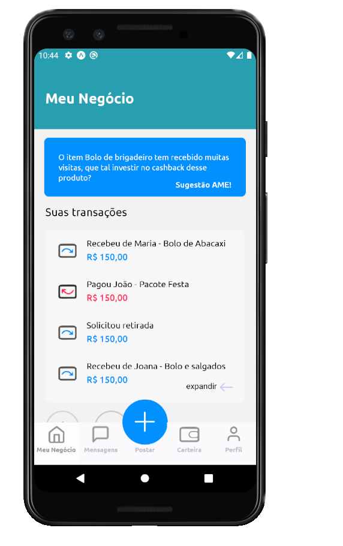
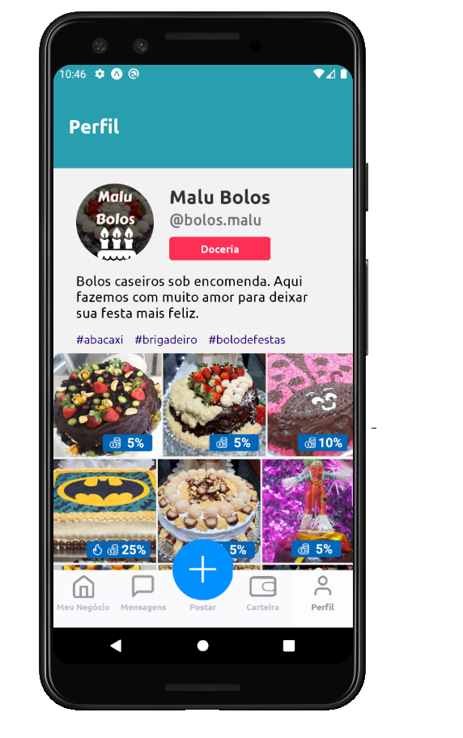

<h1 align ="center" display= 'flex'>
    </img>
    </img>

</h1>

## Ame - Pequenos Negócios 🚀 em construção... 🚧

## 💻 Sobre o projeto

Pensando em resolver problema dentro do que foi requerido no desafio AME, desenvolvemos o AME – Pequenos
Negócios. Uma solução que procura ter a facilidade das postagens como em uma rede social associada à organização de
um marketplace, livrando os MEIs de catálogos exaustivos. Prezando acessibilidade através de uma interface fluida,
simples e amigável.

## 🛠 Tecnologias

- React Native
- Expo
- Typescript

## 🎨 Layout
- [Figma](https://www.figma.com/file/kxMeQl6AXbNQHNw55Oz1L1/Ame---pequenos-neg%C3%B3cios?node-id=0%3A1)

## 🤖 Equipe
- [Bianca](https://github.com/bkkater)
- [Paulo](https://www.linkedin.com/in/paulodocarmo/)
- [Juliana](https://www.linkedin.com/in/juliana-talita-b683581b2/)
- [Daniel](https://www.linkedin.com/in/daniel-mattos-passy-671b8a69/)
- [Rodrigo](https://www.linkedin.com/in/rodrigo-de-ara%C3%BAjo-tem%C3%B3teo-42020317/)

## 📏 Mentores
- [Vinícius Gabeira](https://www.linkedin.com/in/viniciuscola/)
- [Silas Moreira](https://www.linkedin.com/in/silasmoreira/)

### 📱 Como Rodar o Projeto
Para rodar o projeto mobile você precisa de um celular com o [expo](https://play.google.com/store/apps/details?id=host.exp.exponent) instlado ou um emulador android/ios.

```bash
# Vá para a pasta mobile
$ cd summit-mobile

# Instale as depedencias
$ yarn install

# Rode a aplicação
$ yarn start
```
Depois leia o QRCode com o app do [expo](https://play.google.com/store/apps/details?id=host.exp.exponent) ou rode em um emulador.


